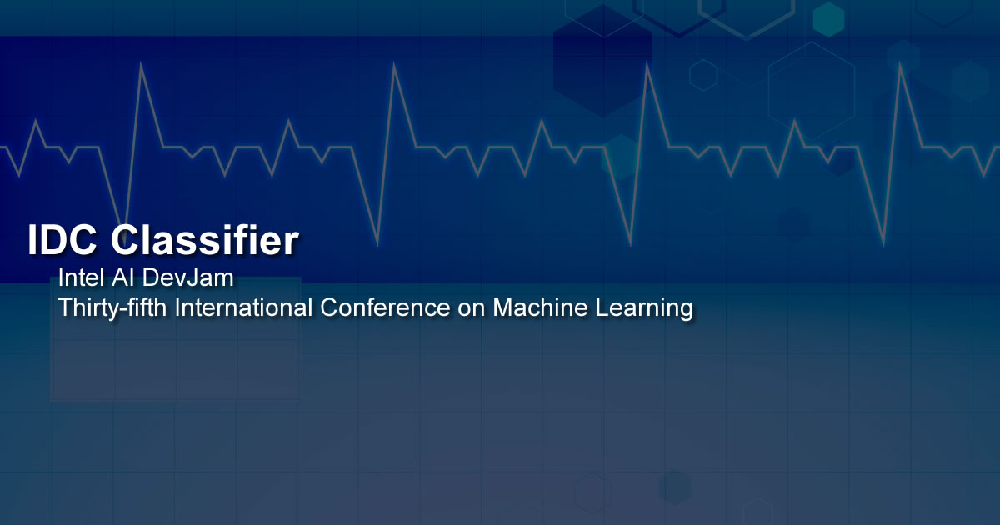

# IDC Classifier



## Introduction

**IDC Classifier** uses **Tensorflow** & **Inception V3** to provide a way to train a neural network with labelled breast cancer histology images to detect **Invasive Ductal Carcinoma (IDC)** in unseen/unlabelled images.

For classification the project uses the **Intel® Movidius** and a custom trained **Inception V3 model** for detecting **Invasive Ductal Carcinoma (IDC)**.

To read a technical article article about the project, please visit [Machine Learning and Mammography](https://software.intel.com/en-us/articles/machine-learning-and-mammography "Machine Learning and Mammography") on Intel AI Academy.

## What Will We Do?


1. Install the [Intel® NCSDK](https://github.com/movidius/ncsdk "Intel® NCSDK") on a Linux development device.
2. Install the [Intel® NCSDK API](https://github.com/movidius/ncsdk "Intel® NCSDK API") on a Raspberry Pi 3 / UP Squared.
3. Clone & set up the repo.
4. Prepare your IDC training dataset.
5. Finetuning your IDC training parameters.
6. Train Inception V3 IDC Classification model on Intel® AI DevCloud.
7. Convert the model to a format suitable for the Movidius.
8. Test the IDC classifier locally on the Linux development device.
9. Live IDC classification via the server / client.

## Python Versions

- Tested in Python 3.5

## Software Requirements

- [Intel® NCSDK](https://github.com/movidius/ncsdk "Intel® NCSDK")
- [Tensorflow 1.4.0](https://www.tensorflow.org/install "Tensorflow 1.4.0")

## Hardware Requirements

- 1 x [Free Access to Intel® AI DevCloud](https://software.intel.com/en-us/ai-academy/tools/devcloud "Free Access to Intel® AI DevCloud")
- 1 x [Intel® Movidius](https://www.movidius.com/ "Intel® Movidius")
- 1 x Linux Device for training & converting the trained model to a Movidius friendly model.
- 1 x Raspberry Pi 3 / UP Squared for the classifier / server.

## Install NCSDK On Your Development Device


The first thing you will need to do is to install the **NCSDK** on your development device, this will be used to convert the trained model into a format that is compatible with the Movidius.

```
 $ mkdir -p ~/workspace
 $ cd ~/workspace
 $ git clone https://github.com/movidius/ncsdk.git
 $ cd ~/workspace/ncsdk
 $ make install
```

Next plug your Movidius into your device and issue the following commands:

```
 $ cd ~/workspace/ncsdk
 $ make examples
```

## Install NCSDK On Your Raspberry Pi 3 / UP Squared

Next you will need to install the **NCSDK** on your **Raspberry Pi 3** / **UP Squared** device, this will be used by the classifier to carry out inference on local images or images received via the API we will create. Make sure you have the Movidius plugged in.

```
 $ mkdir -p ~/workspace
 $ cd ~/workspace
 $ git clone https://github.com/movidius/ncsdk.git
 $ cd ~/workspace/ncsdk/api/src
 $ make
 $ sudo make install
```
```
 $ cd ~/workspace
 $ git clone https://github.com/movidius/ncappzoo
 $ cd ncappzoo/apps/hello_ncs_py
 $ python3 hello_ncs.py
```

## Cloning The Repo

You will need to clone this repository to a location on your development terminal. Navigate to the directory you would like to download it to and issue the following commands.

    $ git clone https://github.com/BreastCancerAI/IDC-Classifier.git

Once you have the repo, you will need to find the files in this folder located in [BreastCancerAI/IDC-Classifier](https://github.com/BreastCancerAI/IDC-Classifier "BreastCancerAI/IDC-Classifier").

## Preparing Your IDC Training Data

For this tutorial, I used a dataset from Kaggle ( [Breast Histopathology Images](https://www.kaggle.com/paultimothymooney/breast-histopathology-images "Breast Histopathology Images") ), but you are free to use any dataset you like. Once you decide on your dataset you need to arrange your data into the **model/train** directory. Each subdirectory should be named with integers, I used 0 and 1 to represent positive and negative. In my testing I used 4400 positive and 4400 negative examples giving an overall training accuracy of 0.8596 (See Training Results below) and an average confidence of 0.96 on correct identifications. The data provided is 50px x 50px, as Inception V3 was trained on images of size 299px x 299px, the images are resized to 299px x 299px, ideally the images would be that size already so you may want to try different datasets and see how your results vary.

## Finetuning Your Training Parameters

You can finetune the settings of the network at any time by editing the classifier settings in the **required/confs.json** file.

```
"ClassifierSettings":{
    "dataset_dir":"model/train/",
    "log_dir":"model/_logs",
    "log_eval":"model/_logs_eval",
    "classes":"model/classes.txt",
    "labels":"labels.txt",
    "labels_file":"model/train/labels.txt",
    "validation_size":0.3,
    "num_shards":2,
    "random_seed":50,
    "tfrecord_filename":"200label",
    "file_pattern":"200label_%s_*.tfrecord",
    "image_size":299,
    "num_classes":2,
    "num_epochs":60,
    "dev_cloud_epochs":40,
    "test_num_epochs":1,
    "batch_size":10,
    "test_batch_size":36,
    "initial_learning_rate":0.0001,
    "learning_rate_decay_factor":0.96,
    "num_epochs_before_decay":10,
    "NetworkPath":"",
    "InceptionImagePath":"model/test/",
    "InceptionThreshold": 0.54,
    "InceptionGraph":"model/idc.graph",
    "InceptionGraphDevCloud":"model/idcdc.graph",
    "Graph":"model/tass.graph",
    "Dlib":"model/dlib/shape_predictor_68_face_landmarks.dat",
    "dataset_dir":"model/train/",
    "TestingPath":"data/testing/",
    "ValidPath":"data/known/"
}
```

## Training Your IDC Model On Intel® AI DevCloud

Now you are ready to upload the files and folders outlined below to AI DevCloud.

```
model
tools
DevCloudTrainer.ipynb
DevCloudTrainer.py
Eval.py
```

Once uploaded, follow the instructions in **DevCloudTrainer.ipynb**, this notebook will help you sort your data, train your model and evaluate it.

## Training Results


## Evaluating Your Model

Once you have completed your training on the AI DevCloud, complete the notebook by running the evaluation job.

```
INFO:tensorflow:Global Step 1: Streaming Accuracy: 0.0000 (2.03 sec/step)
INFO:tensorflow:Global Step 2: Streaming Accuracy: 0.8889 (0.59 sec/step)
INFO:tensorflow:Global Step 3: Streaming Accuracy: 0.8750 (0.67 sec/step)
INFO:tensorflow:Global Step 4: Streaming Accuracy: 0.8981 (0.65 sec/step)
INFO:tensorflow:Global Step 5: Streaming Accuracy: 0.8681 (0.76 sec/step)
INFO:tensorflow:Global Step 6: Streaming Accuracy: 0.8722 (0.64 sec/step)
INFO:tensorflow:Global Step 7: Streaming Accuracy: 0.8843 (0.64 sec/step)

-------------------------------------------------------------------------

INFO:tensorflow:Global Step 68: Streaming Accuracy: 0.8922 (0.81 sec/step)
INFO:tensorflow:Global Step 69: Streaming Accuracy: 0.8926 (0.70 sec/step)
INFO:tensorflow:Global Step 70: Streaming Accuracy: 0.8921 (0.63 sec/step)
INFO:tensorflow:Global Step 71: Streaming Accuracy: 0.8929 (0.84 sec/step)
INFO:tensorflow:Global Step 72: Streaming Accuracy: 0.8932 (0.75 sec/step)
INFO:tensorflow:Global Step 73: Streaming Accuracy: 0.8935 (0.61 sec/step)
INFO:tensorflow:Global Step 74: Streaming Accuracy: 0.8942 (0.67 sec/step)
INFO:tensorflow:Final Streaming Accuracy: 0.8941
```


## Download Your Model

When the training completes you need to download **model/DevCloudIDC.pb** and **model/classes.txt** to the **model** directory on your development machine, ensure the Movidius is setup and connected and then run the following commands on your development machine:

```
$ cd ~/IoT-JumpWay-Microsoft-Examples/Intel-AI-DevJam-IDC/IDC-Classifier
$ ./DevCloudTrainer.sh
```

The contents of DevCloudTrainer.sh are as follows:

```
#IDC Classification Trainer
mvNCCompile model/DevCloudIDC.pb -in=input -on=InceptionV3/Predictions/Softmax -o igraph
python3.5 Classifier.py Inception
python3.5 Classifier.py Facenet
```

1. Compile the model for Movidius
2. Test the Inception V3 model
3. Test the Facenet model

## Testing Your IDC Model

Once the graph has been compiled a testing program will start.  In my **IDC** example there are two classes 0 and 1 (**IDC negative** & **IDC positive**), a classification of 0 shows that the AI thinks the image is not IDC positive, and a classification of 1 is positive.

```
!! Welcome to the Intel AI DevJam Classifier, please wait while the program initiates !!

-- Running on Python 3.5.2 (default, Nov 23 2017, 16:37:01)
[GCC 5.4.0 20160609]

-- INCEPTION V3 TEST MODE STARTED: :  2018-06-09 08:36:21.539925
-- Loaded Test Image model/test/negative.png
-- DETECTION STARTING
-- STARTED: :  2018-06-09 08:36:21.551393
-- DETECTION ENDING
-- ENDED:  2018-06-09 08:36:23.460571
-- TIME: 1.909158706665039

!! TASS Did Not Identify IDC

-- Published to Device Warnings Channel

-- Published: 2
-- Published to Device Sensors Channel
-- Loaded Test Image model/test/positive.png
-- Published: 3
-- DETECTION STARTING
-- STARTED: :  2018-06-09 08:36:23.470298
-- DETECTION ENDING
-- ENDED:  2018-06-09 08:36:25.349699
-- TIME: 1.8793988227844238

!! TASS Identified IDC with a confidence of 0.945

-- INCEPTION V3 TEST MODE ENDING
-- ENDED:  2018-06-09 08:36:25.353735
-- TESTED:  2
-- IDENTIFIED:  1
-- TIME(secs): 3.813807725906372

!! SHUTTING DOWN !!
```

## Serving Your Live IDC Model

Now that we are all trained and tested, it is time to set up the server that will serve an **API** that provides access to your trained models. The Universal Windows Application will use this API to interact with the AI for training / classifying etc.

- **Server.py** starts an **Rest api server** with **API endpoints** for both your **IDC** and **Facenet** classifiers.
- **Client.py** is provided to test sending images via HTTP to the API to receive a classification.

The server is currently set to start up on localhost, if you would like to change this you need to edit line 281 of **Server.py** and line 38 of **Client.py** to match your desired host. Once you have things working, if you are going to be leaving this running and access it from the outside world you shoud secure it with LetsEncrypt or similar.

Upload the following files and folders to the UP Squared or Raspberry Pi 3 that you are going to use for the server.

```
data/captured/
data/known/
data/testing/
model/test/
model/classes.txt
required/confs.json
tools

Client.py
Server.py
```

4. Open up a terminal and navigate to the to the folder containing Server.py then issue the following command. This will start the server and wait to receive images for classification.

```
$ python3.5 Server.py
```

```
!! Welcome to Intel AI DevJam Classification Server, please wait while the program initiates !!

-- Running on Python 3.5.2 (default, Nov 23 2017, 16:37:01)
[GCC 5.4.0 20160609]
-- Imported Required Modules
-- API Initiating
-- API Intiated
-- Initiating JumpWayMQTT Device
-- JumpWayMQTT Device Initiated
-- JumpWayMQTT Device Connection Initiating
-- JumpWayMQTT Device Connection Initiated
-- iotJumpWay Initiated
-- Classifier Initiated
 * Running on http://###.###.#.##:####/ (Press CTRL+C to quit)
-- JumpWayMQTT Device Connected
rc: 0
-- Published to Device Status
-- Published: 1

```

5. If you have followed all of the above steps, you can now start the client with the following commands:

```
$ python3.5 Client.py
```

This will send a positive and negative histology slides and test faces to the Raspberry Pi 3 / UP Squared which will return the predictions.

```
!! Welcome to Intel AI DevJam IDC Demo Classification Client, please wait while the program initiates !!

-- Running on Python 3.5.2 (default, Nov 23 2017, 16:37:01)
[GCC 5.4.0 20160609]
-- Imported Required Modules
-- IDC Classification Client Initiated

-- Using IDC Classification
-- Testing Dir: model/test/
-- Sending model/test/negative.png
{'Response': 'OK', 'ResponseMessage': 'IDC Not Detected!', 'Results': 0}
-- Testing Dir: model/test/
-- Sending model/test/positive.png
{'Response': 'OK', 'ResponseMessage': 'IDC Detected!', 'Results': 1}
```
```
!! Welcome to Intel AI DevJam Classification Server, please wait while the program initiates !!

-- Running on Python 3.5.2 (default, Nov 23 2017, 16:37:01)
[GCC 5.4.0 20160609]

-- Movidius Connected
-- Allocated IDC Graph OK
-- IDC Categories Loaded OK: 4
-- INCEPTION V3 IDC INFERENCE STARTED:  2018-06-09 20:28:40.305284

-- Loading Sample
-- Loaded Sample
-- IDC DETECTION STARTED: :  2018-06-09 20:28:40.315430

-- IDC DETECTION ENDED:  2018-06-09 20:28:42.224892
-- TIME: 1.9094266891479492

!! TASS Identified IDC with a confidence of 0.945
-- Published: 4
-- Published to Device Warnings Channel

-- Published: 5
-- Published to Device Sensors Channel

-- INCEPTION V3 LIVE INFERENCE ENDING
-- ENDED:  2018-06-09 20:28:42.729121
-- TESTED:  1
-- IDENTIFIED:  1
-- TIME(secs): 2.423848867416382

```

# DISCLAIMER

The purpose of the tutorial and source code for **Invasive Ductal Carcinoma (IDC) Classification Using Computer Vision & IoT** is to help people learn how to create computer vision projects and for people interested in the medical use case evaluate if it may help them and to expand upon. Although the the program is fairly accurate in testing, this project is not meant to be an alternative for use instead of seeking professional help. I am a developer not a doctor or expert on cancer.

- **Acknowledgement:** Uses code from Intel® **movidius/ncsdk** ([movidius/ncsdk Github](https://github.com/movidius/ncsdk "movidius/ncsdk Github"))
- **Acknowledgement:** Uses code from chesterkuo **imageclassify-movidius** ([imageclassify-movidius Github](https://github.com/chesterkuo/imageclassify-movidius "imageclassify-movidius Github"))

## Bugs/Issues

Please feel free to create issues for bugs and general issues you come across whilst using this or any other BreastCancerAI repo issues: [BreastCancerAI Github Issues](https://github.com/BreastCancerAI/IDC-Classifier/issues "BreastCancerAI Github Issues")

## Contributors

[](https://github.com/AdamMiltonBarker)

