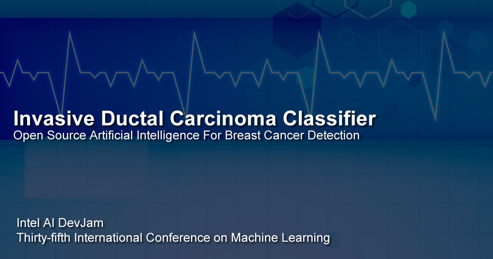

# IDC Classifier

## Introduction

The **IDC Classifier** is an open source **computer vision** program created to classify **Invasive Ductal Carcinoma** (IDC) positive and negative samples. The project includes a number of sub projects using different frameworks and models such as **Tensorflow** & **Inception V3**, and **Caffe** & **CaffeNet**. 

The dataset used with the IDC classifer is an open dataset: [Breast Histopathology Images](https://www.kaggle.com/paultimothymooney/breast-histopathology-images "Breast Histopathology Images") on [Kaggle](https://www.kaggle.com "Kaggle") by [Paul Mooney](https://www.kaggle.com/paultimothymooney "Paul Mooney").

For **classification/inference** the project uses the **Intel® Movidius™ Neural Compute Stick**, a USB stick designed to accelerate computer vision on the edge.

To read a technical article article about the IDC Classifier, please visit [Machine Learning and Mammography](https://software.intel.com/en-us/articles/machine-learning-and-mammography "Machine Learning and Mammography") on Intel AI Academy documentation.

The **Intel AI DevJam Demo** project, **Reducing False Negatives in the IDC Classifier**, provides the source codes and tutorials for setting up the project that was demonstrated at **Intel AI DevJam** at **ICML** (**International Conference on Machine Learning**) in **Sweden**, July 2018.

The **Intel® AI DevJam Demo GUI** uses a **Windows application** to communicate with a **facial recognition classifier** and an option of two classifiers trained to detect **Invasive Ductal Carcinoma (Breast cancer)** in **histology images**. The project combines the  [Invasive Ductal Carcinoma (IDC) Classification Using Computer Vision & IoT](https://github.com/iotJumpway/IoT-JumpWay-Intel-Examples/tree/master/Intel-Movidius/IDC-Classification "Invasive Ductal Carcinoma (IDC) Classification Using Computer Vision & IoT") and [TASS Movidius Facenet Classifier](https://github.com/iotJumpway/IoT-JumpWay-Intel-Examples/tree/master/Intel-Movidius/TASS/Facenet "TASS Movidius Facenet Classifier") projects, along with some new improvements.

The goal of this project is to intentionally try to trick the model by using very similar, but opposite class, images from a small set of testing data that I believe humans may have difficulty telling apart. A larger set of testing data is provided to compare how the model works on larger datasets. When **false negatives** are found we will attempt to find a way to reduce them, providing a safety net for incorrect classifications that could mean the difference between life and death.

# DISCLAIMER

The purpose of the tutorial and source code for the **IDC Classifier** is to help people learn how to create computer vision projects and for people interested in the medical use case evaluate if it may help them and to expand upon. Although the the program is fairly accurate in testing, this project is not meant to be an alternative for use instead of seeking professional help. I am a developer not a doctor or expert on cancer.

- **Acknowledgement:** Uses code from Intel® **movidius/ncsdk** ([movidius/ncsdk Github](https://github.com/movidius/ncsdk "movidius/ncsdk Github"))
- **Acknowledgement:** Uses code from chesterkuo **imageclassify-movidius** ([imageclassify-movidius Github](https://github.com/chesterkuo/imageclassify-movidius "imageclassify-movidius Github"))

## Bugs/Issues

Please feel free to create issues for bugs and general issues you come across whilst using this or any other BreastCancerAI repo issues: [BreastCancerAI Github Issues](https://github.com/BreastCancerAI/IDC-Classifier/issues "BreastCancerAI Github Issues")

## Contributors

